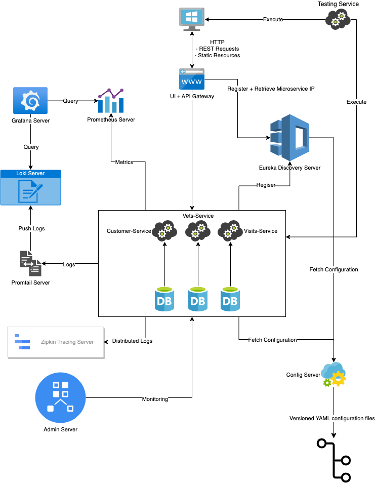

= Spring Pet Clinic Micro Services
:doctype: book
:idprefix:
:idseparator: -
:toc: left
:toclevels: 4
:tabsize: 4
:numbered:
:sectanchors:
:sectnums:
:hide-uri-scheme:
:docinfo: shared,private
:attribute-missing: warn

[[intro]]
== Intro

This is distributed version of the Spring Pet Clinic Sample app built with Spring & Flutter Web. These microservices fork initially inspired by https://github.com/spring-petclinic/spring-petclinic-microservices[spring-petclinic-microservices] to demonstrate how to split sample Spring application into microservices. Multiple technologies are considered for this demonstration which are

* Java 17 & Maven with 3rd party libraries (Lombok, Mapstruct, JOOQ, Flyway, Micrometer)
* Spring Boot (Web, Data JPA, Admin Server)
* Spring Cloud (Config, Eureka Discovery, Gateway)
* Docker
* Promtail
* Prometheus
* Loki
* Grafana
* Flutter Web
* H2 SQL Database
* Playwright for E2E testing

== Architecture

* http://www.h2database.com/html/tutorial.html[H2] database is used for storing data via https://github.com/oscarfonts/docker-h2[`oscarfonts/h2`] docker image.
* Zipkin
* https://github.com/codecentric/spring-boot-admin[spring-petclinic-admin-server]
 ** Admin UI for services health and activity.
* https://docs.spring.io/spring-cloud-gateway/reference/index.html[spring-petclinic-api-gateway]
 ** API gateway for all backend services. Front-End also included in this module.
* https://docs.spring.io/spring-cloud-config/docs/current/reference/html[spring-petclinic-config-server]
 ** Configs are centralized in single module at separate git repository that cloud be referenced locally. Should be started first.
* https://cloud.spring.io/spring-cloud-netflix/reference/html/[spring-petclinic-discovery-server]
 ** Spring cloud netflix used for service discovery as centralized point for all other services. Should be started second after `spring-petclinic-config-server`
* spring-petclinic-customer-service - Restful APIs
* spring-petclinic-vets-service - Restful APIs
* spring-petclinic-visits-service - Restful APIs
* spring-petclinic-test-service - With everything up and running, this test module responsible for validating that everything is OK in automated way.

== Start services using docker

=== Prerequisites

* Docker >= 24.0.2
* JDK 17, Maven & Flutter SDK are required. Not required for building inside docker but note that building using docker without SDKs requires a lot of RAM usage.

=== Compose

[source,bash]
----
# Compile and build everything locally
# Excluding E2E test module
mvn clean package -pl !spring-petclinic-test-service

# Build the images
# Use docker-compose.yml for building everything inside docker (high RAM usage)
docker compose -f docker-compose-nosdk.yml build

# Run all
docker compose -f docker-compose-nosdk.yml up

# Shutdown and remove resources
docker compose -f docker-compose-nosdk.yml down
----

== Start services locally

=== Prerequisites

* JDK 17
* Maven 3.9.x
* Flutter SDK >= 3.10.5
* Docker >= 24.0.2

=== Info

* Run the following to start database and observability services.(Note: In Windows PowerShell replace `$(PWD)` with `$+{PWD}+`)

[source,bash]
----
# Create network for our usage
docker network create --ipv6=false -d bridge MyBridgeNetwork

# Run H2 Database
docker container run -d --name h2-server --network=MyBridgeNetwork -d -p 9092:1521 -p 81:81 --mount 'type=volume,src=h2-data,dst=/opt/h2-data' -e H2_OPTIONS=-ifNotExists oscarfonts/h2

# Run tracing and monitoring servers
docker container run -d --name zipkin-server --network MyBridgeNetwork -p 9411:9411 openzipkin/zipkin
docker container run -d --name promtail-server --network MyBridgeNetwork -v  ${PWD}/docker/promtail/promtail-config.yaml:/mnt/config/promtail-config.yaml -v ${PWD}/log:/var/log/services grafana/promtail:2.8.0 --config.file=/mnt/config/promtail-config.yaml
docker container run -d --name loki-server --network MyBridgeNetwork -v  ${PWD}/docker/loki/loki-config.yaml:/mnt/config/loki-config.yaml -p 3100:3100 grafana/loki:2.8.0 --config.file=/mnt/config/loki-config.yaml
docker container run -d --name prometheus-server --network MyBridgeNetwork -p 9090:9090 -v  ${PWD}/docker/prometheus/:/etc/prometheus/ prom/prometheus
docker container run -d --name=grafana-server --network MyBridgeNetwork -p 3000:3000 -v  ${PWD}/docker/grafana/provisioning:/etc/grafana/provisioning -v  ${PWD}/docker/grafana/grafana.ini:/etc/grafana/grafana.ini -v  ${PWD}/docker/grafana/dashboards:/var/lib/grafana/dashboards grafana/grafana-oss

# Run Spring boot apps
mvn -pl spring-petclinic-config-server clean spring-boot:run -"Dspring-boot.run.profiles=native" -"Dspring-boot.run.arguments=--config.file-repo=/Users/elsagheera/Desktop/code/other/spring-petclinic-ms-config/" -D spring-boot.run.jvmArguments="-Xmx128m"
mvn -pl spring-petclinic-discovery-server clean spring-boot:run -D spring-boot.run.jvmArguments="-Xmx128m"
mvn -pl spring-petclinic-admin-server clean spring-boot:run -D spring-boot.run.jvmArguments="-Xmx128m"
mvn -pl spring-petclinic-api-gateway clean spring-boot:run -D spring-boot.run.jvmArguments="-Xmx128m"
mvn -pl spring-petclinic-customer-service clean spring-boot:run -"Dspring-boot.run.profiles=default,h2" -D spring-boot.run.jvmArguments="-Xmx128m"
mvn -pl spring-petclinic-visits-service clean spring-boot:run -"Dspring-boot.run.profiles=default,h2" -D spring-boot.run.jvmArguments="-Xmx128m"
----

* Services locations

.Services Locations
[options="header,footer"]
|===
| Service | Endpoint
| Discovery Server  | http://localhost:7772
| Config Server  | http://localhost:7771
| Flutter Web UI & API Gateway  | http://localhost:7778
| Customers | http://localhost:7773 - http://localhost:7773/docs/api.html[API Docs] - http://localhost:7773/swagger-ui.html[Swagger UI] - http://localhost:7773/v3/api-docs.yaml[OpenAPI Specs]
| Vets | http://localhost:7774
| Visits | http://localhost:7775
| Tracing Server (Zipkin) | http://localhost:9411/zipkin/ (we use openzipkin)
| Admin Server (Spring Boot Admin) | http://localhost:7776
| Grafana Dashboards  | http://localhost:3000
| Prometheus | http://localhost:9090
| Loki | http://localhost:3100/metrics
|===

== Plus

=== Testing

* `spring-petclinic-test-service` responsible for testing the functionality running within other services. Typically, this is via calling APIs and verify the responses or simply simulating user experience.
  * https://junit.org/junit5/[Junit 5]
  * https://docs.spring.io/spring-framework/reference/testing/webtestclient.html[WebTestClient]
  * https://playwright.dev/[Playwright]
  * https://github.com/json-path/JsonPath[JsonPath]

[source,bash]
----
# Validate everything is working correctly by running
# the test service and open spring-petclinic-test-service/target/site/index.html
# in a browser
# Install browser to be used for testing
# For Windows PowerShell it is
# $env:PLAYWRIGHT_SKIP_BROWSER_DOWNLOAD=1
export PLAYWRIGHT_SKIP_BROWSER_DOWNLOAD=1
export DEBUG=pw:browser
mvn exec:java -e -D exec.mainClass=com.microsoft.playwright.CLI -pl spring-petclinic-test-service -D exec.args="install firefox"

# Validate everything is working correctly by running
# the test service and open spring-petclinic-test-service/target/site/index.html
# in a browser
mvn -pl spring-petclinic-test-service clean verify site -D maven.plugin.validation=VERBOSE -D global.host=localhost
----

=== Development

* Dependencies & Editors
** VSCode. Configurations for `Microsodt Visual Studio Code` for running and debugging all services available in `.vscode` for `Windows OS`. Note that docker dependent services should be up and running first.

== Status & Progress

As this is still work in progress, there are multiple stages to be done for a complete demonstration.

* TODO
** [line-through]#ArchUnit#
** [line-through]#Ui end-to-end test#
** Add custom labels and tags to prometheus and loki usage
** Data initialization for vets and visits services
** Vets and error front-end implementation
** [line-through]#Modularity support#
** https://medium.com/azulsystems/using-jlink-to-build-java-runtimes-for-non-modular-applications-9568c5e70ef4[Jlink or artifact and runtime optimization and graalvm]
** Include chaos (not final)
** [line-through]#Unit tests#
** CI/CD Tool  (not final)
** Default data
** Spring security
** Keycloak
** Code optimization
** Java 21 and version upgrade
** e2e testing from separated docker container
* Done
** [line-through]#Monitoring verification#
** [line-through]#Docker Compose#
** [line-through]#Architecture doc#
** [line-through]#Commands for starting services locally using SDKs and docker desktop (i.e. in Intellij IDE)#
** [line-through]#Commands for starting services locally using docker desktop with docker being target platform#
* All services to be up and running locally with default configuration
** [line-through]#Make sure JOOQ generation of classes done automatically#
** [line-through]#Generate external config for Observability and tracing for plug & play#
** [line-through]#Validate functionality of Grafana#
** Custom Labels in Grafana for prometheus and loki
* [line-through]#Create separate module for testing all the up and running service automating that everything is up and running as expected#
* [line-through]#All services to be up and running locally#
* [line-through]#All services to be up and running using docker with and without local SDK#
